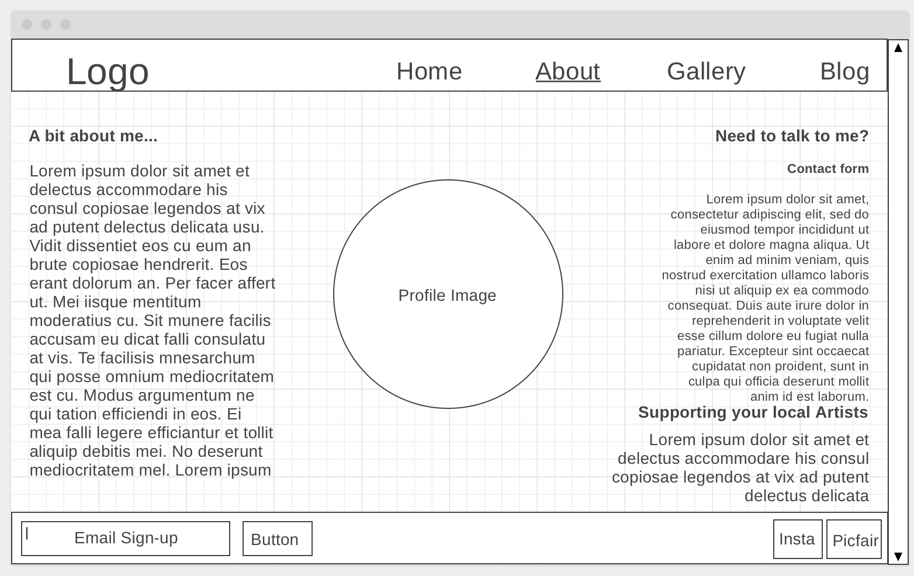
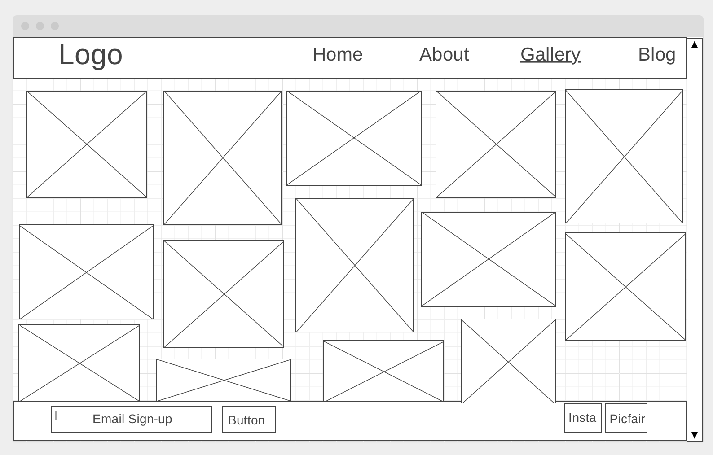
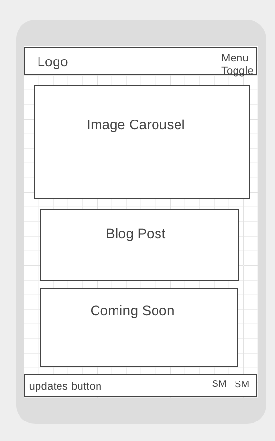
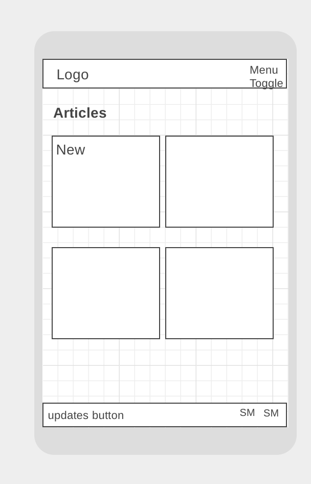

    

# William Marjoribanks | Photography Website

## Description

Welcome to William Marjoribanks Photography website. This website has been designed to be an online portal to the current and
ongoing photographic portoflio of William Marjoribanks. As well as being a site to read blog posts, relevant to travel it offers the 
option to purchase selected artworks, by means of using a third party site. In addition to this, it gives the option for users 
to contact the photographer for potential or upcoming projects as well as English language education to students.

## Deployment

This website has been deployed to Github pages and can be accessed by [clicking here.](https://lhbank.github.io/MS1/)

## User Experience (UX)

## User Stories

### First Time Visitor Goals
* As a new user to the site, I want to be able to visit the site and understand its main purpose.
* As a new user to the site, I want to be able to navigate easily through the site to find specific content regarding the site's purpose and purchase
  artworks through a third party website.
* As a new user to the site, I want to have the option to sign up to new content updates by submitting my email address by means of a contact form.
* As a new user to the site, I want to have the option to visit social media sites, related to the author and owner of the photography portfolio.

### Returning Visitor Goals

* As a returning user to the site, I want to be able to contact the author and owner of potential project ideas.
* As a returning user to the site, I want to be informed of any discounts or offers available for sale against the cost of the art promote 
  through the gallery and third party site, PicFair.

### Frequent User Goals
* As a frequent user of the site, I want to visit the blog page of the site to keep up to date of any new content added.

## Design 

### Colour Scheme
The colour theme chosen to style the included content was generated by Coolors. The colour palette began with a Pewter blue, for the navigation bar
and footer. a contrasting green was used for cursor hovering and buttons, with a custom black and contrasting cream colour used throughout for text input,
and content.

### Typography
Throughout the site, a constant theme used was by using Italiana, Nanum Gothic and Almaira, from Google Fonts. Italiana was
used against headings and input forms including buttons, and Nanum Gothic as the primary font for navigation links and text content
not included in any heading elements. Almaira was used against the heading and content elements in the Modal Window to match that of the
third party site where images can be purchased. Sans Serif was used as a substitute where the aforementioned custom fonts were not supported 
by selected browsers or devices.

### Imagery
With imagery being at the forefront and of utmost importance to the site, original artworks owned by William Marjoribanks, were used throughout
the website to display high quality images, and the result they could expect from purchasing a piece from the portfolio.

## Wireframes
### Desktop Wireframe
 
 

### Mobile Device
 
 

# Features
* High quality photography portfolio.
* Interactive links to related social media networks and subscription.
* Interactive links to purchase artworks through a third party website.

# Technologies Used

## Languages Used

* HTML5
* CSS3

## Frameworks, Libraries & Programs Used
* Bootstrap 4.5
* GitHub
* Gitpod
* WireframeCC - This service was utilised to create sample wireframe guides to structure the content to be displayed on the site.
* Google Fonts
* Font Awesome
* Coolors - This service, was used to generate a colour palette which would be used against all elements in a consistent theme throughout
  the site.
* Lightroom 4 - Pre-installed photography editing software used to compress the images used throughout the gallery pages.

# Testing

## Testing User Stories from User Experience (UX) Section

### First Time Visitor Goals
* As a first time user, I was able to see that the site was dedicated to a photographer or travel enthusiast.
* As a first time user, I was able to navigate with ease throughout the site using the navbar at the head of page, to each
dedicated section and had options which linked to third party sites.
* As a first time user, I had various ways of signing up to site updates via: the "Contact" page in the navigation bar and
the "Register Here" button on the homepage landing card.
* As a first time user, after visiting all dedicated pages throughout the sites, the option to connect through social media/networks
was made available consistently in the footer of the page, via dedicated logos which I recognised immediately.
### Returning Visitor Goals
* As a returning user of the site, I was able to contact the author of this page using the "Contact" page form, regarding a tour
I was interested in taking with my family, and who would take payment.
* As a returning visitor, I was able to find out if initially unavailable images which I had selected on my previous visit were now
able to be printed, by clicking on the selected artwork. I was also linked to the "Contact" page by clicking the "More Info" button
on the pop-up window of a selected artwork.

### Frequent User Goals
* As a frequent user of the site, after registering for updates on submitting my details via the "Contact" page, I was able to navigate
with ease to the blog section of the site, to read the newest blog article. I was also able to access this via the homepage, from
the advertised article at the bottom left of the page.

## Further Testing

# Known Bugs

# Credits

## Code

* **Hover** effect on 'Choose Art' button on homepage, found at: https://www.developerdrive.com/8-simple-css-hover-effects/

## Content
## Media
#### YouTube Links Used as Reference Guide:
* [Click here for the link](https://www.youtube.com/watch?v=qmPmwdshCMw) used for further practical explanation of Bootstrap Grid - supplied by my mentor.
## Acknowledgements
Many thanks to my mentor, Felipe Souza Alarcon, for being able to assist me at a moments notice, when I was encountering difficulty with various aspects of the project
 and for ensuring I make the most of the tools available to me.
